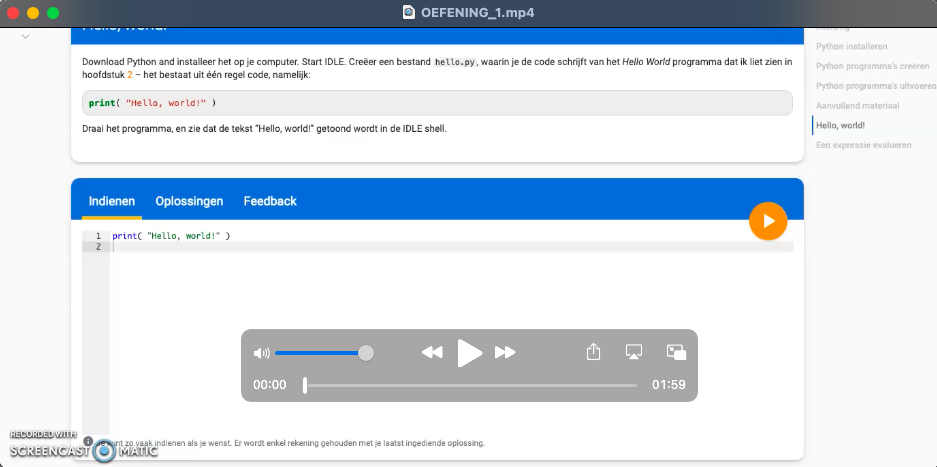
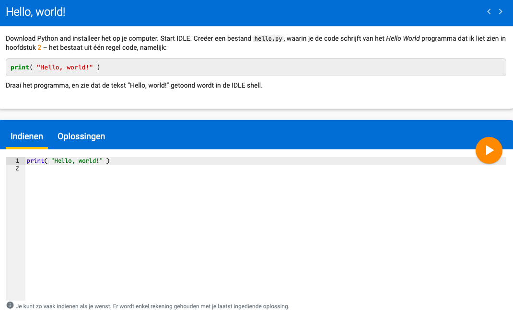
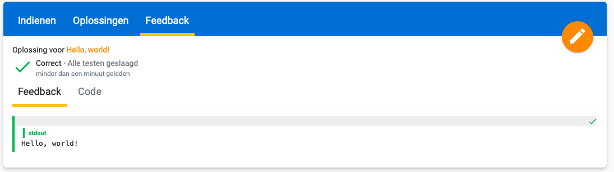
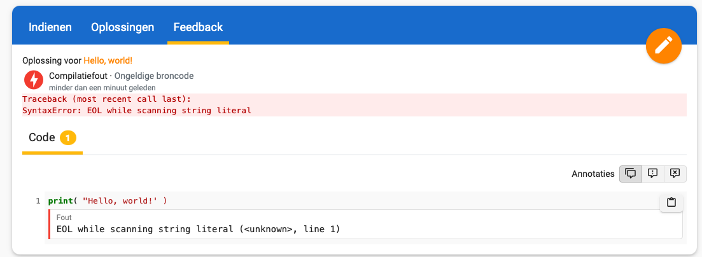

De oefeningen in Dodona zijn net een beetje anders dan in Minecraft. We leggen eerst verschillende codes uit, samen met hun betekenis. 
Daarna kan je met de codes oefenen. 

Aan de hand van deze eerste oefening leer je Dodona beter kennen. Je kan kiezen of je onderstaand filmpje bekijkt, of eerder de uitleg leest. 

Uitleg: 

1. De introductie van de oefening in de leeromgeving is niet belangrijk, deze mag je dus overslaan. 

2. Er wordt gevraagd om de volgende code in te geven: print( "Hello, world!" ). Deze code staat reeds klaar. Druk op de gele knop en zie het scherm veranderen.

3. Je komt op een feedback scherm. Hier kan je zien dat de code correct is.

4. Mocht je een foutje maken dan zal je een rood icoontje verkrijgen. Waarom het fout is, moet je zelf onderzoeken. 

Probeer dit gerust zelf eens uit om Dodona te leren kennen. Wanneer je de omgeving begrijpt kan je verder naar de volgende oefening. 