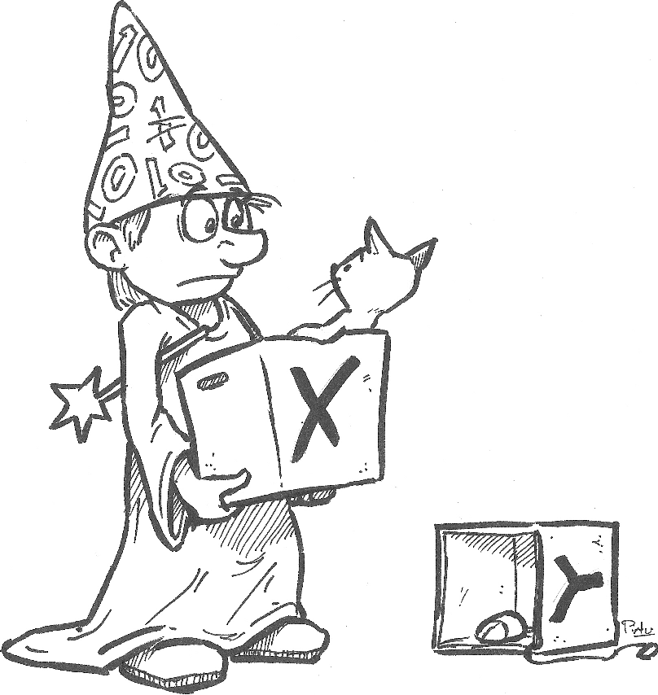

Als je met code werkt, ben je vaak bezig met het ontwerpen van een procedure (of “algoritme”) dat een probleem op een algemeen toepasbare manier oplost. 
Bijvoorbeeld, de code print(5+7)  lost een rekensom op. De code die je schreef herkent 5 en 7 als getallen, 
maar je kan deze getallen ook onder een ander lettertje of cijfertje opslaan. Stel dat je 5 wil opslaan onder de letter x, dan kan dat via de volgende code:

```python
x = 5
```

Wanneer je dit ingeeft weet de computer dat, wanneer je ‘x’ gebruikt in jouw code, je eigenlijk het cijfertje 5 bedoelde. Je creëerde een nieuwe variabele, namelijk de variabele x. 
Je kunt je de variabele x voorstellen als een doos waarop je met een dikke, zwarte viltstift een x hebt geschreven, zodat je hem later gemakkelijk terug kunt vinden. 
Je kunt iets in de doos stoppen, en je kunt in de doos kijken om te zien wat er in zit (er kan wel slechts één ding tegelijkertijd in de doos zitten). 
In ons geval zit momenteel het cijfertje ‘5’ in de doos (in x).

{:data-caption="Een variabele kan je voorstellen als een doos waarop je met een dikke, zwarte viltstift een naam hebt geschreven, zodat je hem later gemakkelijk kunt terugvinden. Je kunt iets in de doos stoppen, en je kunt in de doos kijken om te zien wat er in zit (er kan wel slechts één ding tegelijkertijd in de doos zitten). Je kunt aan de inhoud van de
doos refereren door de naam te gebruiken die je op de doos hebt geschreven." width="35%"}

Wanneer je nu de volgende functie print, zal het cijfertje 5 tevoorschijn komen. 

```python
print(x)
```

`5`

### Merk op:

1. Om een variabele te creëren, gebruik je het is-gelijk (=) symbool. 

2. Aan de linkerkant van het is-gelijk symbool zet je de variabele naam (in bovenstaand voorbeeld noemt de variabele x).

3. Aan de rechterkant komt de waarde die je wilt opslaan in de variabele (in bovenstaand voorbeeld is dit de waarde 5).  
